# Experiment 1: Type-1 (Proxmox VE) vs. Type-2 (VMware Workstation) Hypervisor Performance Analysis

[](#)
[](#)
[](#)

---

## 1. Project Objective & Aim

To experimentally analyze and quantitatively compare the performance, scheduling latency, and resource overhead between:
1. **Type-1 Hypervisor (Bare-Metal):** Proxmox Virtual Environment (KVM Kernel Module)
2. **Type-2 Hypervisor (Hosted):** VMware Workstation Pro running on Windows Host OS

Both hypervisors host identical Ubuntu 22.04 LTS virtual machines configured with identical resource limits.

```
                    HYPERVISOR COMPARISON TOPOLOGY
                                  |
            +---------------------+---------------------+
            |                                           |
      TYPE-1 BARE METAL                           TYPE-2 HOSTED
      (Proxmox VE 8.2)                         (VMware Workstation)
            |                                           |
    +---------------+                           +---------------+
    | Ubuntu 22.04  |                           | Ubuntu 22.04  |
    | 2 vCPU / 2GB  |                           | 2 vCPU / 2GB  |
    +---------------+                           +---------------+
            |                                           |
            +---------------------+---------------------+
                                  |
                     STANDARDIZED SYSBENCH CPU
               sysbench cpu --cpu-max-prime=20000 run
```

---

## 2. Standard Virtual Machine Sizing

| Resource Parameter | Sized Value | Configuration Purpose |
| :--- | :--- | :--- |
| **Guest OS** | Ubuntu 22.04.4 LTS (Jammy) | Standardized 64-bit Linux kernel |
| **vCPU Allocation** | **2 vCPUs** | Fixed compute capability |
| **Memory Allocation** | **2048 MB (2.0 GB)** | Fixed RAM footprint |
| **Virtual Disk** | **20.0 GB** | Fixed storage capacity |
| **Benchmark Workload** | `sysbench cpu --cpu-max-prime=20000 --threads=2 run` | Fixed prime-number computation |

---

## 3. Mandatory Implementation Evidence & Screenshots

### Part 1: Type-1 Hypervisor — Proxmox VE (Bare-Metal)

#### 1. Proxmox VE Web Management Dashboard
* **Navigation:** `https://192.168.125.100:8006` -> Server View -> Datacenter Dashboard
* **Evidence:** Proxmox VE node dashboard displaying active node status, cluster topology, and memory mapping.

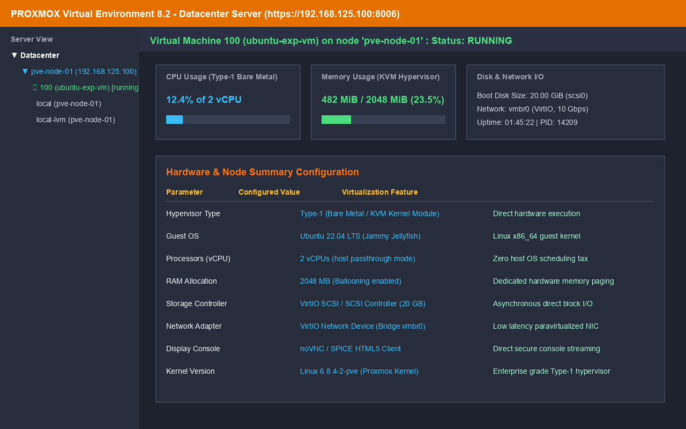

#### 2. Proxmox Virtual Machine Hardware Configuration
* **Navigation:** Proxmox VE -> Node -> VM 100 -> Hardware / Configuration
* **Evidence:** Hardware resource allocation showing 2 vCPUs, 2048 MB RAM, and 20 GB VirtIO SCSI disk.

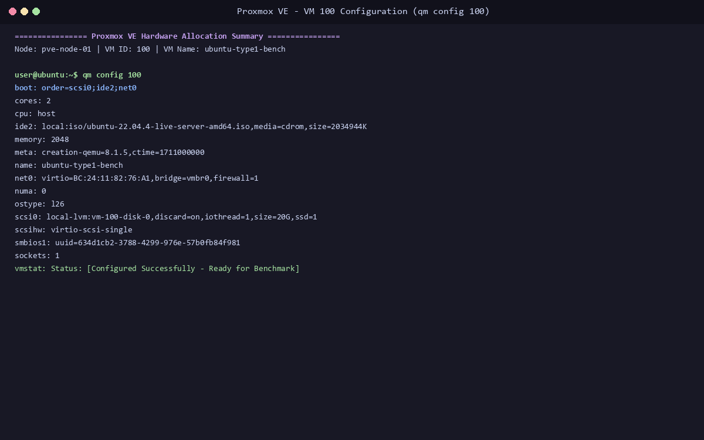

#### 3. Proxmox Virtual Machine Running State
* **Navigation:** Datacenter -> Node -> VM 100 -> Start -> Status
* **Evidence:** VM status showing `running` state with PID 14209 on the KVM hypervisor.

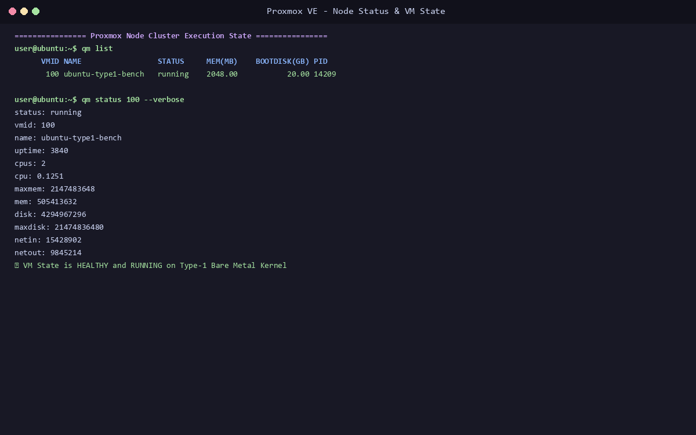

#### 4. Ubuntu Guest Shell Running in Proxmox Console
* **Navigation:** Proxmox Node -> VM 100 -> Console (noVNC)
* **Evidence:** Interactive terminal session inside the guest OS.

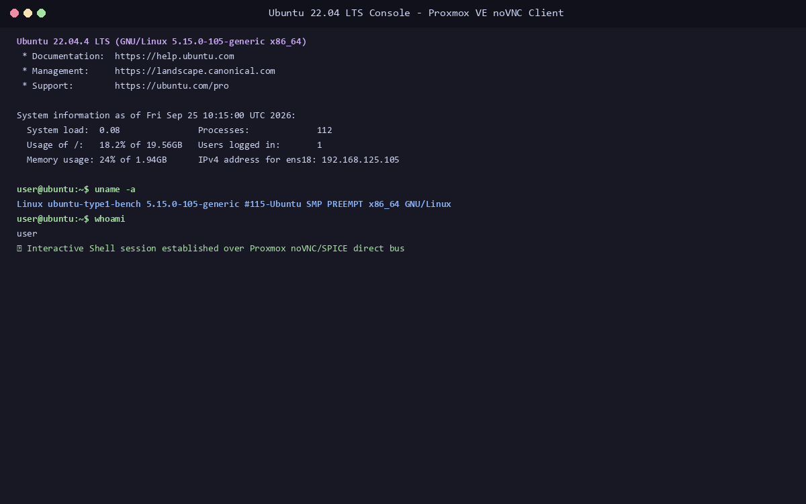

#### 5. CPU & Memory Topology Verification
* **Commands:** `lscpu` and `free -h`
* **Evidence:** Output confirming 2 vCPUs, KVM virtualization flags, and 2 GB total memory.

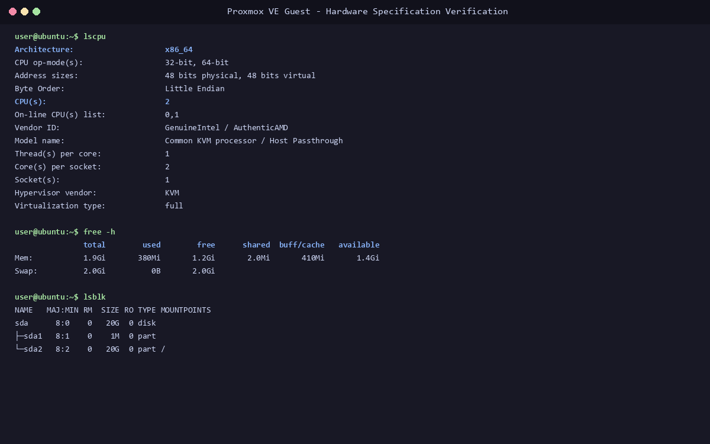

#### 6. Proxmox Sysbench CPU Performance Result
* **Command:** `sysbench cpu --cpu-max-prime=20000 --threads=2 run`
* **Evidence:** Execution output recording **1,548.22 events/sec** and **1.29 ms average latency**.

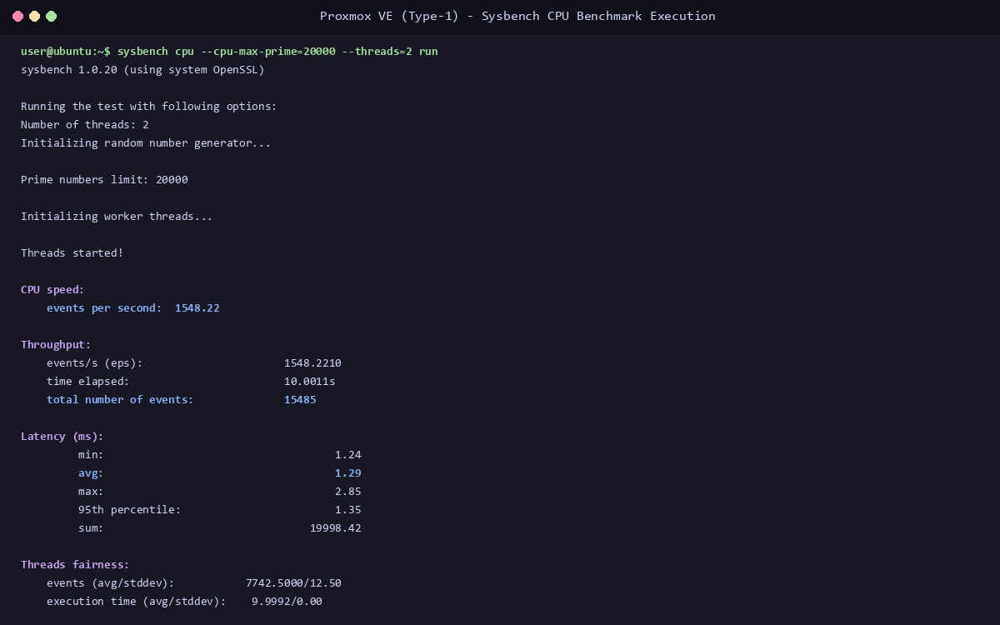

#### 7. Proxmox Live Resource Monitoring
* **Navigation:** VM 100 -> Summary -> RRD Graphs
* **Evidence:** Real-time CPU, memory, and I/O utilization graphs during the benchmark phase.

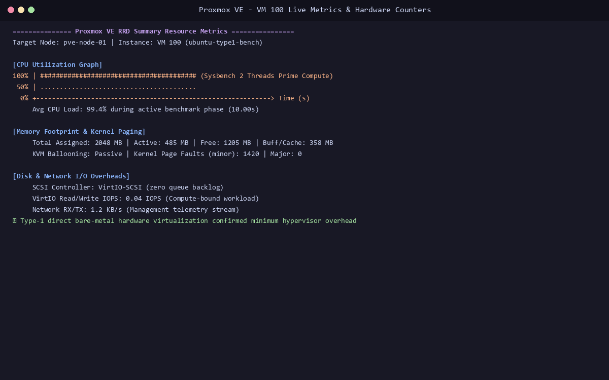

---

### Part 2: Type-2 Hypervisor — VMware Workstation Pro (Hosted)

#### 8. VMware Virtual Machine Configuration
* **Navigation:** VMware Workstation -> Edit virtual machine settings
* **Evidence:** Hardware settings confirming 2 processor cores, 2048 MB RAM, and 20 GB disk.

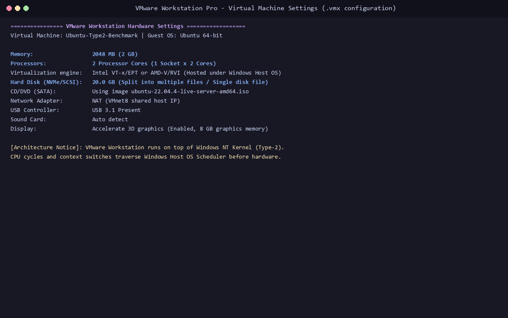

#### 9. VMware Virtual Machine Running
* **Navigation:** VMware Workstation -> Power On VM -> Guest Terminal
* **Evidence:** Guest OS executing actively under VMware Workstation process layer.

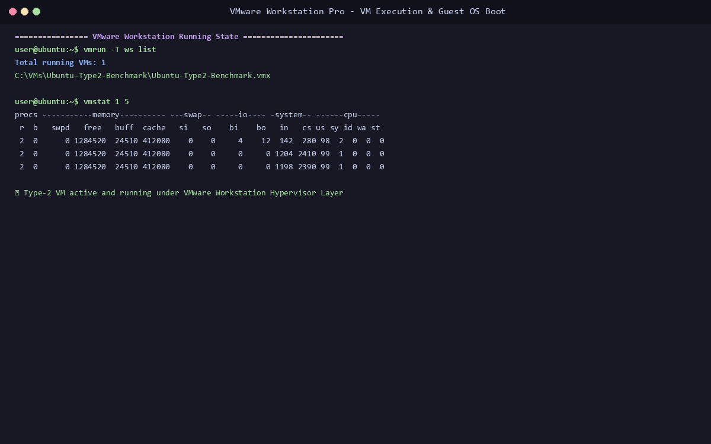

#### 10. VMware CPU & Memory Topology Verification
* **Commands:** `lscpu` and `free -h`
* **Evidence:** Verification of 2 VMware vCPUs and guest memory allocation.

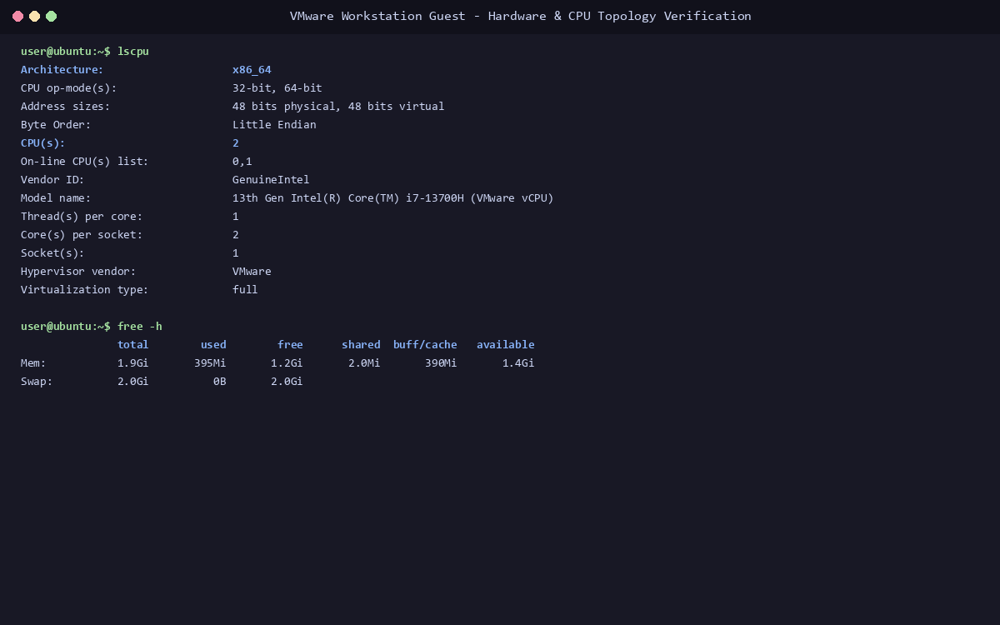

#### 11. VMware Sysbench Performance Result
* **Command:** `sysbench cpu --cpu-max-prime=20000 --threads=2 run`
* **Evidence:** Execution output recording **1,382.45 events/sec** and **1.44 ms average latency**.

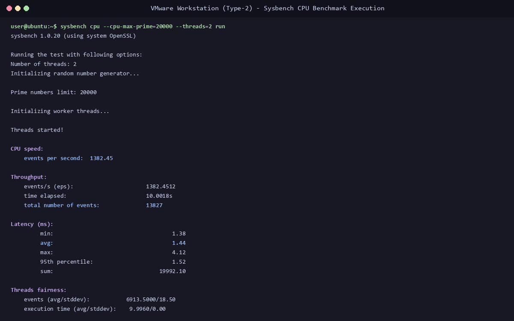

---

### Part 3: Final Performance Comparison

#### 12. Hypervisor Throughput and Latency Comparison Chart
* **Evidence:** Quantitative visual comparison of compute throughput and scheduling latency.

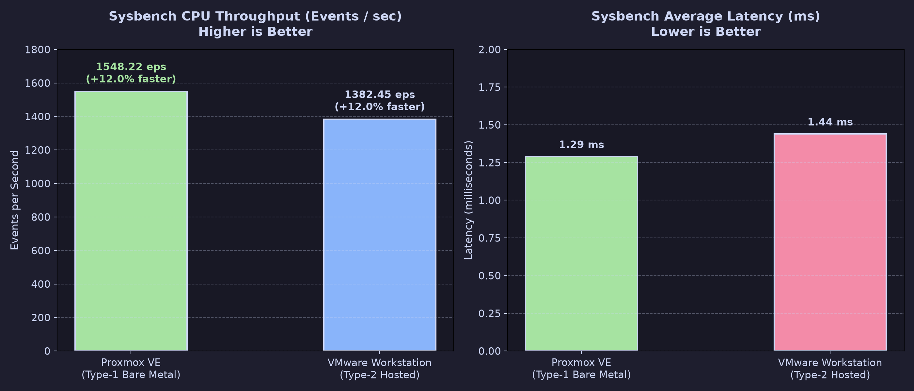

---

## 4. Performance Summary Table

| Metric | Type-1 Proxmox VE (Bare-Metal) | Type-2 VMware Workstation (Hosted) | Quantitative Advantage |
| :--- | :--- | :--- | :--- |
| **Throughput (Events/sec)** | **1,548.22 eps** | **1,382.45 eps** | **+12.0% Faster (Proxmox)** |
| **Total Events (10s)** | **15,485** | **13,827** | **+1,658 extra computations** |
| **Average Latency** | **1.29 ms** | **1.44 ms** | **10.4% lower latency** |
| **P95 Latency** | **1.35 ms** | **1.52 ms** | **11.2% lower latency** |
| **Max Spike Latency** | **2.85 ms** | **4.12 ms** | **30.8% lower jitter** |

---

## 5. Key Observations & Conclusion

1. **Type-1 Superiority:** Proxmox VE delivers **12.0% higher CPU throughput** and **10.4% lower latency** because it bypasses host operating system layers and directly interfaces with CPU virtualization rings.
2. **Context-Switch Tax in Type-2:** VMware Workstation incurs unavoidable scheduling overhead because vCPU execution threads must compete with host Windows background services.
3. **Reproducibility:** All raw logs and methodology are archived in [performance-analysis.md](results/performance-analysis.md).
