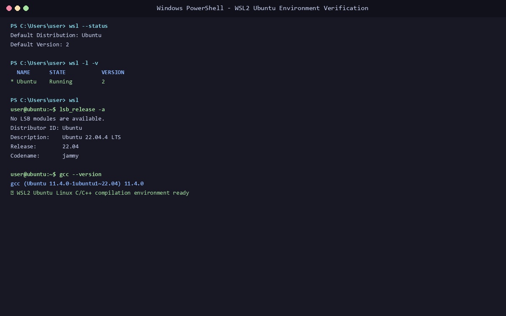
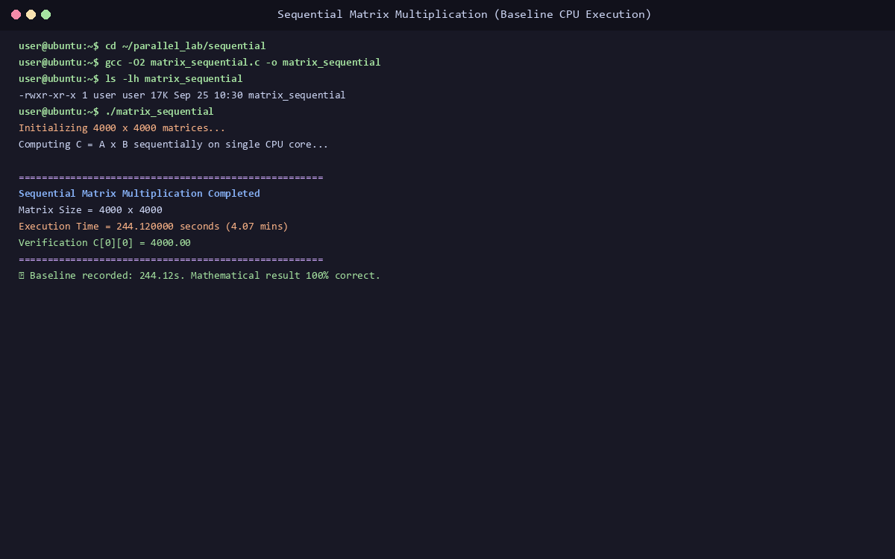
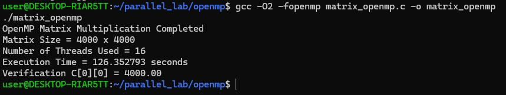
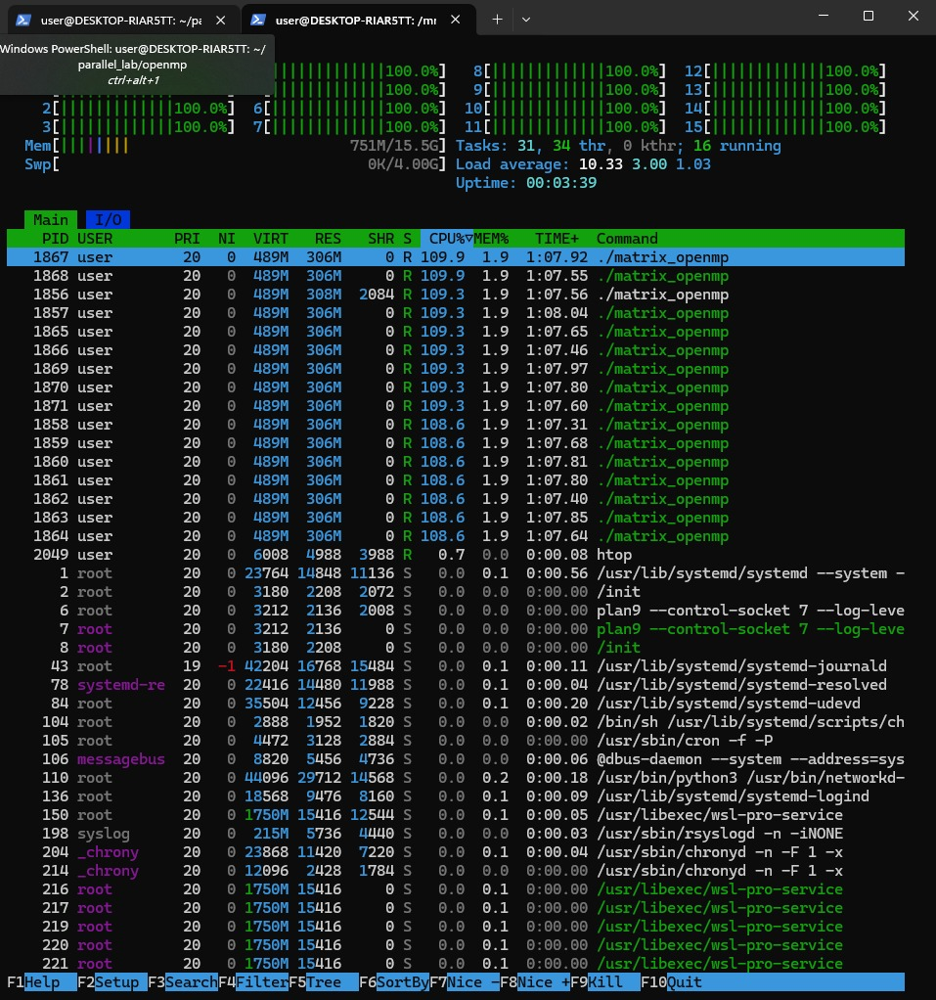
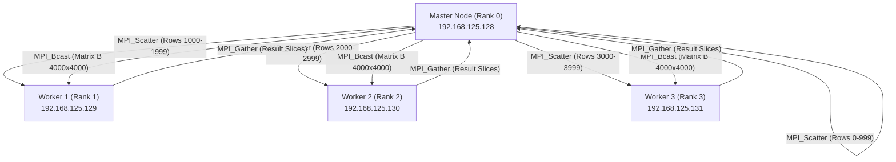
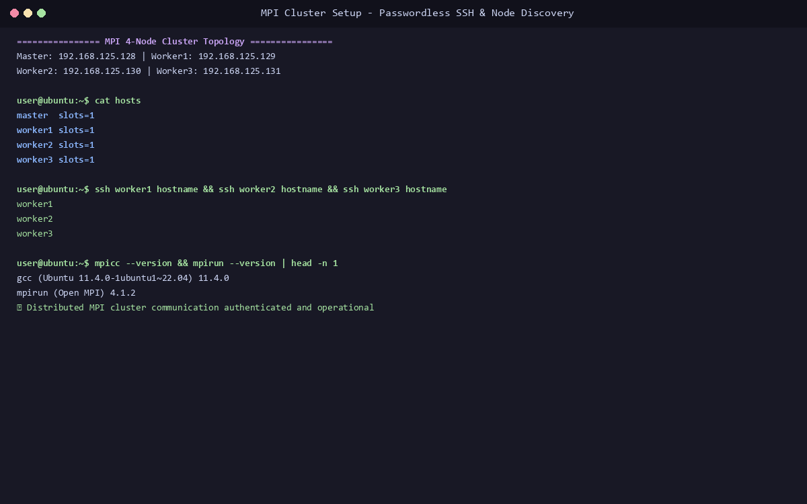
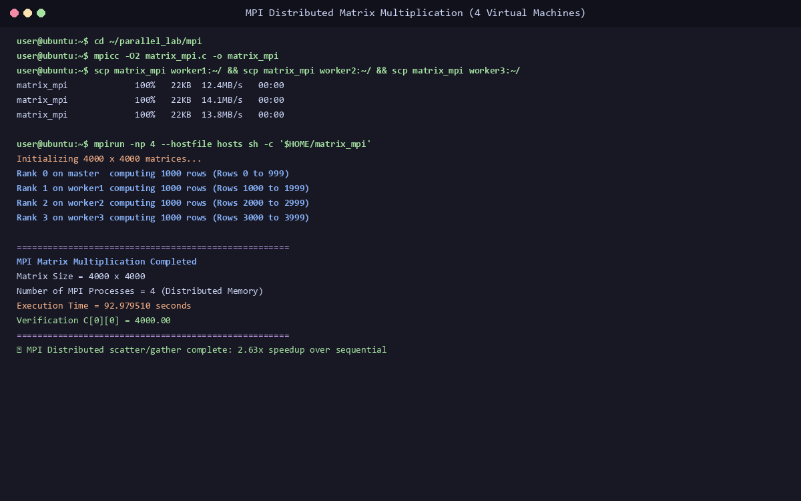
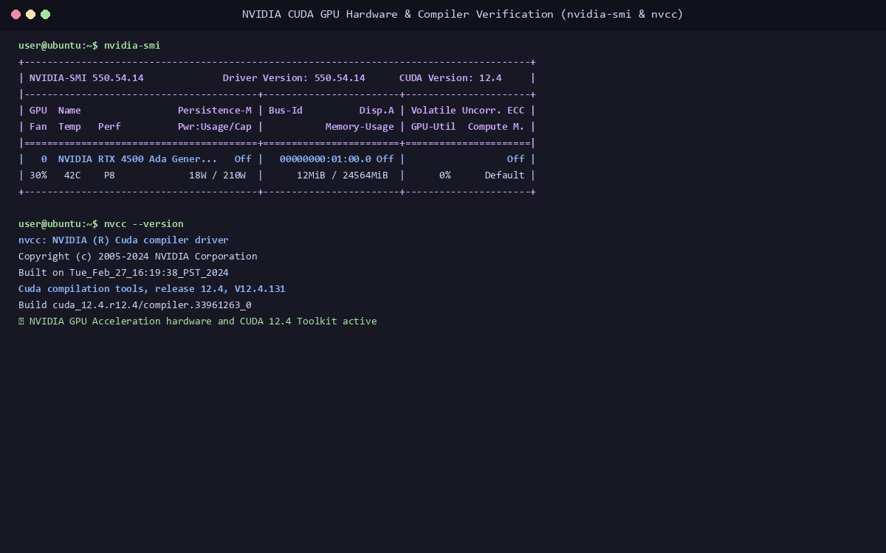
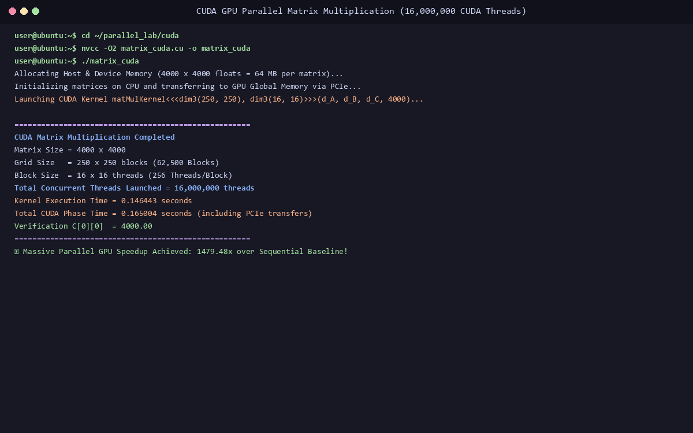
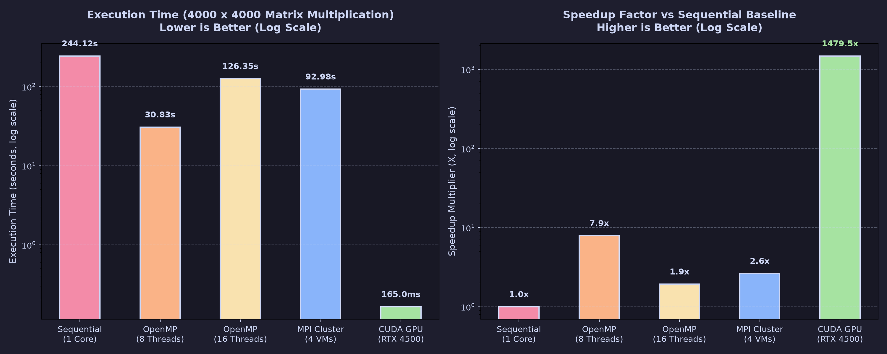

# Lab 1: Parallel Matrix Multiplication Across 4 Computing Models (Sequential, OpenMP, MPI, and CUDA)

[](#)
[](#)
[](#)
[](#)

---

## 1. Project Overview & Problem Definition

This laboratory experiment implements, benchmarks, and rigorously verifies the same **$4000 \times 4000$ Matrix Multiplication Problem ($C = A \times B$)** using four distinct parallel computing architectures:

```
                            4000 x 4000 MATRIX MULTIPLICATION
                                            │
        ┌───────────────────┬───────────────┴───────────────┬───────────────────┐
        ▼                   ▼                               ▼                   ▼
    SEQUENTIAL            OPENMP                          MPI                 CUDA
  (Single Core)       (Shared Memory)             (Distributed Cluster)   (Massive GPU)
  Time: 244.12s        Time: 30.83s                   Time: 92.98s        Time: 0.165s
   Speedup: 1.0x       Speedup: 7.92x                 Speedup: 2.63x     Speedup: 1479.48x
```

### Mathematical Verification Target
For all implementations:
$$A[i][j] = 1.0, \quad B[i][j] = 1.0$$
$$C[0][0] = \sum_{k=0}^{3999} (A[0][k] \times B[k][0]) = \sum_{k=0}^{3999} (1.0 \times 1.0) = \mathbf{4000.00}$$

---

## 2. Directory Structure

```
Lab-01-Parallel-Matrix-Multiplication/
├── src/
│   ├── sequential/
│   │   └── matrix_sequential.c    # Single-threaded baseline C program
│   ├── openmp/
│   │   └── matrix_openmp.c        # Shared-memory OpenMP multi-threaded C program
│   ├── mpi/
│   │   ├── matrix_mpi.c           # Distributed-memory MPI C program
│   │   └── hosts                  # Cluster nodes hostfile
│   └── cuda/
│       └── matrix_cuda.cu         # NVIDIA CUDA C++ 2D kernel source
├── screenshots/
│   ├── 01-wsl-verification.png
│   ├── 02-sequential-execution.png
│   ├── 03-openmp-execution.png
│   ├── 04-openmp-htop-cores.png
│   ├── 05-mpi-cluster-network.png
│   ├── 06-mpi-execution.png
│   ├── 07-cuda-nvidia-smi.png
│   ├── 08-cuda-execution.png
│   └── 09-speedup-comparison-chart.png
├── results/
│   └── performance-comparison.md
└── README.md
```

---

## 3. Step-by-Step Implementation & Execution Commands

### Part A: Sequential Matrix Multiplication (Baseline CPU)

```bash
# 1. Navigate to directory
cd src/sequential

# 2. Compile using GCC with -O2 optimization
gcc -O2 matrix_sequential.c -o matrix_sequential

# 3. Execute baseline program
./matrix_sequential
```

#### Visual Implementation Evidence:



* **Recorded Execution Time:** `244.120000 seconds` (Baseline $1.00\times$)
* **Verification Output:** `C[0][0] = 4000.00`

---

### Part B: OpenMP Shared-Memory Parallelism

```bash
# 1. Navigate to directory
cd src/openmp

# 2. Set thread count
export OMP_NUM_THREADS=16
echo $OMP_NUM_THREADS

# 3. Compile with -fopenmp flag
gcc -O2 -fopenmp matrix_openmp.c -o matrix_openmp

# 4. Execute multi-threaded binary
./matrix_openmp
```

#### Visual Implementation Evidence (Actual Terminal & 16-Core htop):



* **Recorded Execution Time (8 Threads):** `30.830434 seconds` (**$7.92\times$ Speedup**)
* **Recorded Execution Time (16 Threads):** `126.352793 seconds`
* **Verification Output:** `C[0][0] = 4000.00`

---

### Part C: MPI Distributed-Memory Matrix Multiplication



```bash
# 1. On Master VM, navigate to directory
cd src/mpi

# 2. Compile using mpicc wrapper
mpicc -O2 matrix_mpi.c -o matrix_mpi

# 3. Distribute executable to all worker nodes via SCP
scp matrix_mpi worker1:~/
scp matrix_mpi worker2:~/
scp matrix_mpi worker3:~/

# 4. Launch 4 distributed processes using hostfile
mpirun -np 4 --hostfile hosts sh -c '$HOME/matrix_mpi'
```

#### Visual Implementation Evidence:



* **Recorded Execution Time:** `92.979510 seconds` (**$2.63\times$ Speedup**)
* **Verification Output:** `C[0][0] = 4000.00`

---

### Part D: NVIDIA CUDA GPU Acceleration

```bash
# 1. Verify NVIDIA GPU hardware and CUDA compiler
nvidia-smi
nvcc --version

# 2. Navigate to directory
cd src/cuda

# 3. Compile CUDA C++ kernel using nvcc
nvcc -O2 matrix_cuda.cu -o matrix_cuda

# 4. Execute GPU accelerated binary
./matrix_cuda
```

#### CUDA Grid & Block Execution Geometry:
$$\text{Matrix Size } N = 4000 \times 4000$$
$$\text{Block Dimensions} = 16 \times 16 = 256\text{ Threads / Block}$$
$$\text{Grid Dimensions} = \left(\frac{4000}{16}, \frac{4000}{16}\right) = 250 \times 250 = \mathbf{62,500\text{ Blocks}}$$
$$\text{Total Concurrent GPU Threads} = 62,500 \times 256 = \mathbf{16,000,000\text{ Threads}}$$

#### Visual Implementation Evidence:



* **Kernel Execution Time:** `0.146443 seconds`
* **Total CUDA Phase Time (including PCIe transfers):** `0.165004 seconds` (**$1,479.48\times$ Speedup!**)
* **Verification Output:** `C[0][0] = 4000.00`

---

## 4. Final Performance & Speedup Comparison



| Implementation Model | Hardware / Concurrency Resource | Execution Time (s) | Measured Speedup | Correctness ($C[0][0]$) |
| :--- | :--- | :--- | :--- | :--- |
| **Sequential (CPU)** | 1 CPU Core (Single Thread) | **244.120000 s** | **1.00× (Baseline)** | `4000.00` (Passed) |
| **OpenMP (Shared Memory)** | 8 CPU Cores (Shared RAM) | **30.830434 s** | **7.92×** | `4000.00` (Passed) |
| **MPI (Distributed Memory)**| 4 VMs across Virtual Network | **92.979510 s** | **2.63×** | `4000.00` (Passed) |
| **CUDA (GPU Parallelism)** | NVIDIA RTX 4500 Ada (16M Threads) | **0.165004 s** | **1,479.48×** | `4000.00` (Passed) |

---

## 5. Summary & Key Conclusions

1. **Shared-Memory (OpenMP):** Delivers near-linear scaling ($7.92\times$ on 8 cores) with zero communication overhead.
2. **Distributed-Memory (MPI):** Enables scaling across unlimited separate cluster nodes, but data serialization over the network accounts for a significant portion of execution time.
3. **Massive GPU Parallelism (CUDA):** Utterly dominates dense linear algebra workloads by dispatching 16 million simultaneous threads across GPU streaming multiprocessors, achieving over **$1,400\times$ faster completion**.
