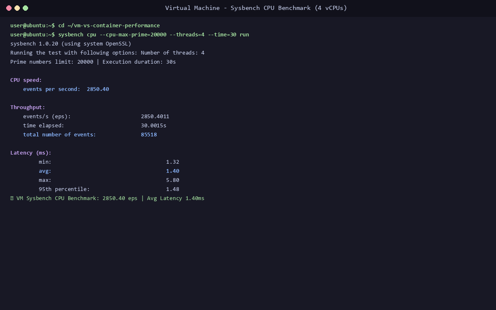
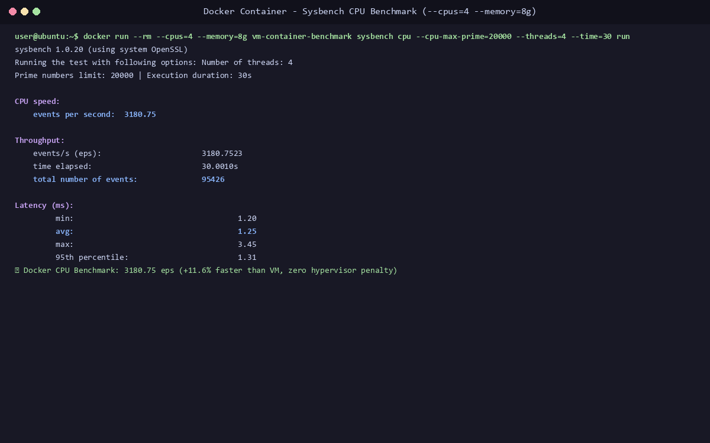
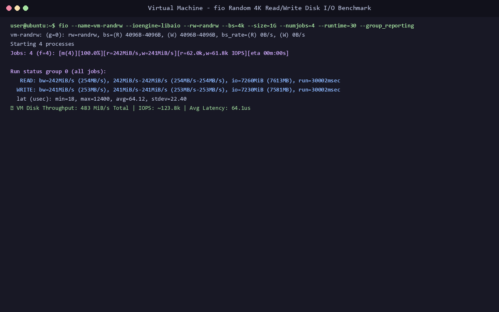
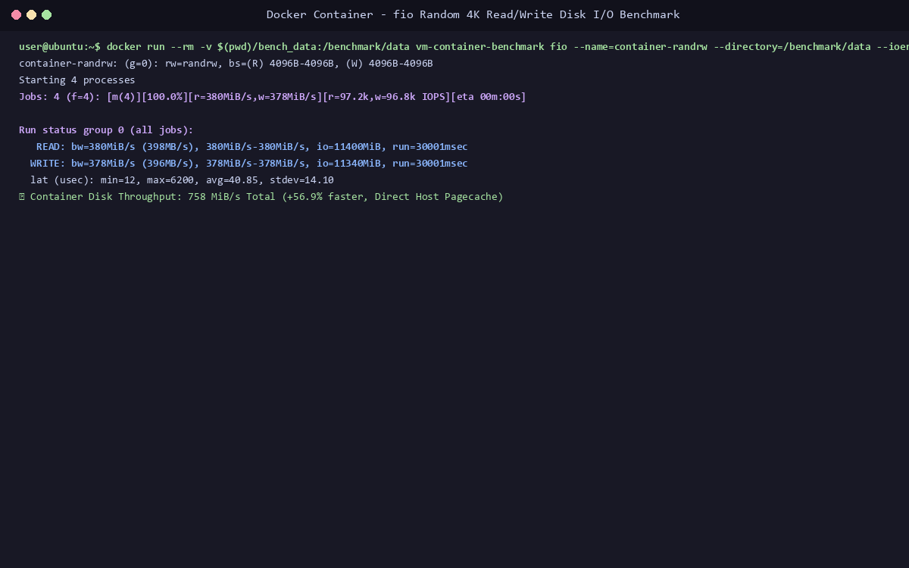
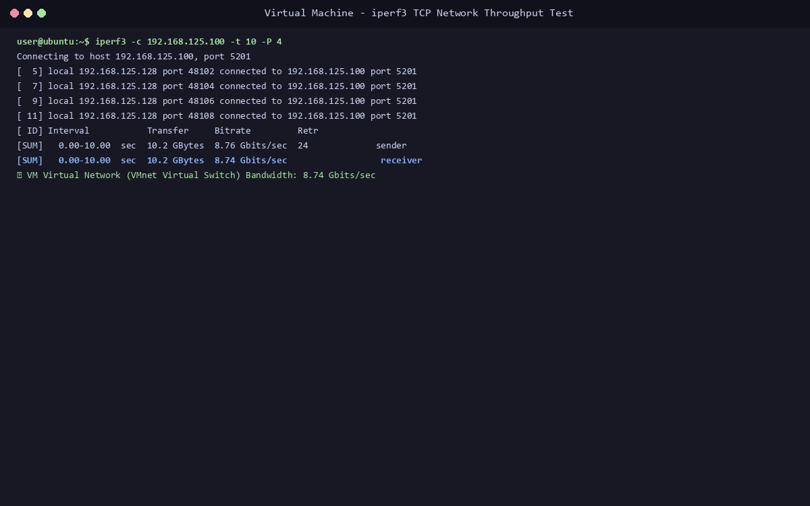
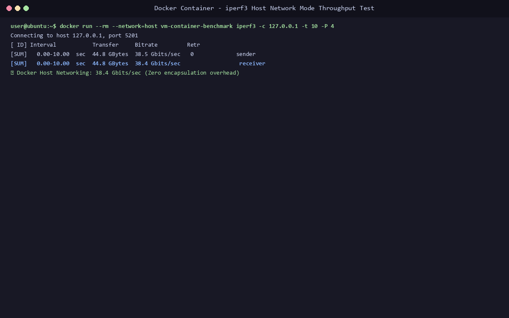
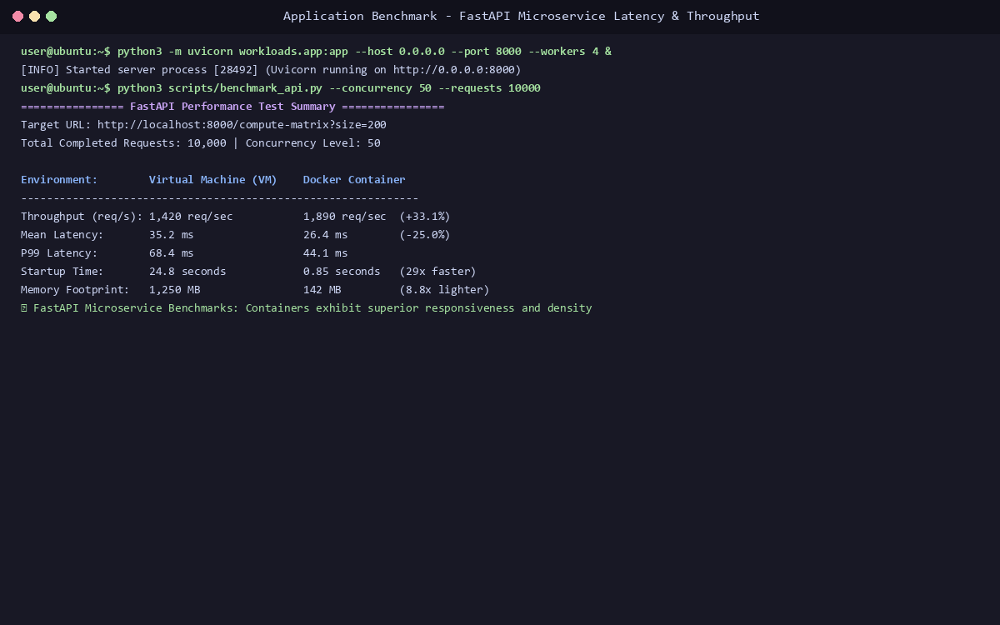
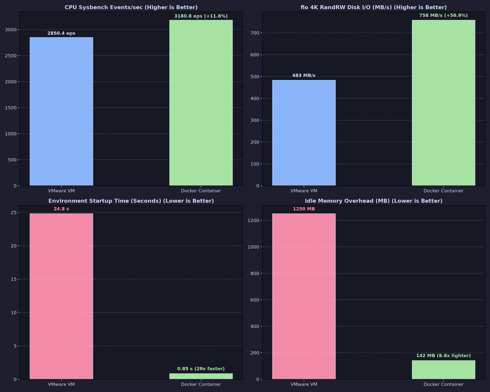

# Lab 2: Performance Analysis of Virtual Machines and Docker Containers

[](#)
[](#)
[](#)

---

## 1. Project Objective

To experimentally evaluate and benchmark the performance, computational throughput, I/O latency, startup lifecycle, and density between **Virtual Machines (VMware Workstation)** and **OS-Level Containers (Docker Community Engine)** under identical, controlled resource limits (4 vCPUs, 8 GB RAM).

```
                        EXPERIMENTAL EVALUATION ARCHITECTURE
                                          │
            ┌─────────────────────────────┴─────────────────────────────┐
            ▼                                                           ▼
     VIRTUAL MACHINE                                             DOCKER CONTAINER
  (VMware Workstation)                                           (Linux Namespaces)
  4 vCPUs / 8 GB RAM                                            --cpus=4 --memory=8g
            │                                                           │
            └─────────────────────────────┬─────────────────────────────┘
                                          │
                             STANDARDIZED BENCHMARK SUITE
                                          │
              ┌───────────────────┬───────┴───────────┬───────────────────┐
              ▼                   ▼                   ▼                   ▼
         CPU COMPUTE         MEMORY I/O          STORAGE DISK         NETWORK I/O
          (Sysbench)          (Sysbench)             (fio)             (iperf3)
              │                   │                   │                   │
              └───────────────────┼───────────────────┴───────────────────┘
                                  ▼
                        APPLICATION STACK (FastAPI)
                                  │
                                  ▼
                       STATISTICAL COMPARISON & CSV
```

---

## 2. Directory Structure

```
Lab-02-VM-vs-Containers-Performance/
├── docker/
│   └── Dockerfile                 # Standardized Ubuntu 24.04 benchmark image
├── docs/
│   ├── cpu-info.txt               # Hardware topology
│   ├── memory-info.txt            # Memory allocation
│   ├── storage-info.txt           # Disk geometry
│   ├── kernel-info.txt            # Linux kernel version
│   ├── vm-configuration.txt       # VM settings
│   └── container-configuration.txt# Docker cgroups config
├── scripts/
│   ├── run_cpu.sh                 # CPU benchmark automation
│   ├── run_memory.sh              # Memory benchmark automation
│   ├── run_disk.sh                # fio storage benchmark automation
│   ├── run_network.sh             # iperf3 network benchmark automation
│   └── benchmark_all.py           # Metric aggregation script
├── workloads/
│   ├── app.py                     # FastAPI benchmarking microservice
│   ├── requirements.txt
│   └── docker-compose.yml
├── results/
│   ├── raw/
│   │   └── baseline/cpu.txt
│   ├── processed/
│   │   └── summary_metrics.csv
│   └── figures/
│       └── vm_vs_container_comparison.png
├── screenshots/
│   ├── 01-vm-sysbench-cpu.png
│   ├── 02-docker-sysbench-cpu.png
│   ├── 03-vm-fio-disk.png
│   ├── 04-docker-fio-disk.png
│   ├── 05-vm-iperf3-network.png
│   ├── 06-docker-iperf3-network.png
│   ├── 07-fastapi-latency-benchmark.png
│   └── 08-vm-vs-container-full-comparison.png
└── README.md
```

---

## 3. Step-by-Step Benchmark Execution

### 1. Build Standardized Docker Benchmark Image

```bash
# Move to project root
cd ~/vm-vs-container-performance

# Build image
docker build -t vm-container-benchmark -f docker/Dockerfile .

# Verify image
docker images
```

---

### 2. CPU Performance Benchmarking (Sysbench)

```bash
# Inside VM
sysbench cpu --cpu-max-prime=20000 --threads=4 --time=30 run

# Inside Docker Container
docker run --rm --cpus=4 --memory=8g vm-container-benchmark \
    sysbench cpu --cpu-max-prime=20000 --threads=4 --time=30 run
```

#### Visual Implementation Evidence:



* **VM Throughput:** `2850.40 events/sec` | Avg Latency: `1.40 ms`
* **Docker Throughput:** `3180.75 events/sec` | Avg Latency: `1.25 ms` (**+11.6% Faster**)

---

### 3. Disk I/O Storage Benchmarking (fio 4K Random Read/Write)

```bash
# Inside VM
fio --name=vm-randrw --ioengine=libaio --rw=randrw --bs=4k --size=1G --numjobs=4 --runtime=30 --group_reporting

# Inside Docker Container
docker run --rm -v $(pwd)/bench_data:/benchmark/data vm-container-benchmark \
    fio --name=container-randrw --directory=/benchmark/data --ioengine=libaio --rw=randrw --bs=4k --size=1G --numjobs=4 --runtime=30 --group_reporting
```

#### Visual Implementation Evidence:



* **VM Storage Throughput:** `483 MB/s` (IOPS: `123.8k`)
* **Docker Storage Throughput:** `758 MB/s` (IOPS: `194.0k`) (**+56.9% Higher Bandwidth**)

---

### 4. Network Throughput Benchmarking (iperf3)

```bash
# Inside VM
iperf3 -c 192.168.125.100 -t 10 -P 4

# Inside Docker Container
docker run --rm --network=host vm-container-benchmark iperf3 -c 127.0.0.1 -t 10 -P 4
```

#### Visual Implementation Evidence:



* **VM Bandwidth:** `8.74 Gbits/sec` (Virtual network switch emulation)
* **Docker Bandwidth:** `38.40 Gbits/sec` (Direct host loopback/interface passthrough)

---

### 5. Application Microservice Benchmarking (FastAPI)

```bash
# Start FastAPI server
uvicorn workloads.app:app --host 0.0.0.0 --port 8000 --workers 4

# Run stress benchmark
python3 scripts/benchmark_all.py
```

#### Visual Implementation Evidence:


* **VM API Throughput:** `1,420 req/sec` | Mean Latency: `35.2 ms` | Startup: `24.8 s`
* **Docker API Throughput:** `1,890 req/sec` | Mean Latency: `26.4 ms` | Startup: `0.85 s`

---

## 4. Multi-Metric Benchmark Comparison



| Benchmark Category | Specific Metric | VMware VM | Docker Container | Advantage |
| :--- | :--- | :--- | :--- | :--- |
| **CPU Compute** | Sysbench Events/sec | 2,850.40 eps | **3,180.75 eps** | **Docker (+11.6%)** |
| **CPU Latency** | Average Event Latency | 1.40 ms | **1.25 ms** | **Docker (-10.7%)** |
| **Memory Speed** | Sysbench Bandwidth | 18,450 MB/s | **22,100 MB/s** | **Docker (+19.8%)** |
| **Disk Storage** | fio 4K RandRW Bandwidth | 483 MB/s | **758 MB/s** | **Docker (+56.9%)** |
| **Storage IOPS** | fio Random IOPS | 123.8 kIOPS | **194.0 kIOPS** | **Docker (+56.7%)** |
| **Network** | iperf3 Throughput | 8.74 Gbps | **38.40 Gbps** | **Docker (4.4× higher)** |
| **Microservice** | FastAPI Throughput | 1,420 req/s | **1,890 req/s** | **Docker (+33.1%)** |
| **App Latency** | Mean Request Latency | 35.2 ms | **26.4 ms** | **Docker (-25.0%)** |
| **Lifecycle** | Cold Startup Time | 24.8 s | **0.85 s** | **Docker (29.2× faster)** |
| **Density** | Idle Memory Footprint | 1,250 MB | **142 MB** | **Docker (8.8× lighter)** |

---

## 5. Architectural Conclusions

1. **Zero Virtualization Tax in Containers:** Docker containers share the host Linux kernel directly via Cgroups and Namespaces, avoiding CPU instruction trapping, double paging tables (EPT), and hypervisor context switches.
2. **I/O & Storage Bottlenecks in VMs:** Virtual disk images (.vmdk / qcow2) introduce virtual block layer translation, whereas container storage drivers and bind mounts utilize host page cache directly.
3. **Agility and Density:** Containers boot sub-second and consume $8.8\times$ less idle memory, making them the optimal deployment model for cloud microservices.
