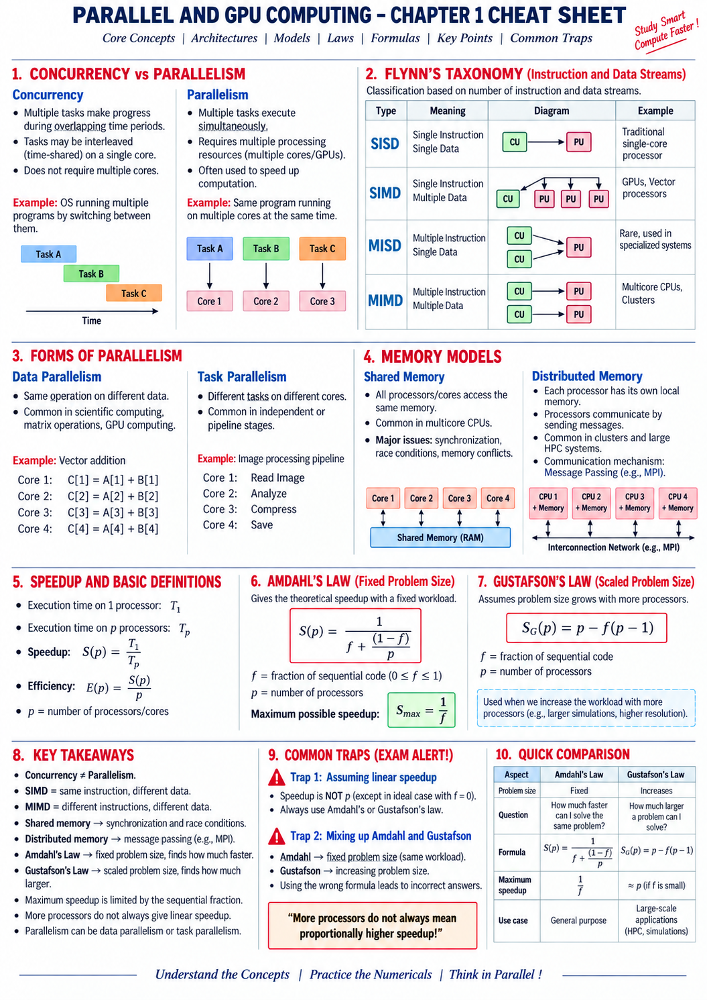

# Chapter 1: Introduction to Parallel and GPU Computing



## 1. Concurrency vs. Parallelism

| Characteristic | Concurrency | Parallelism |
| :--- | :--- | :--- |
| **Definition** | Multiple tasks make progress during overlapping time periods via time-slicing / interleaving. | Multiple tasks execute literally at the exact same instant in time. |
| **Hardware Requirement** | Can run on a **single core** (via OS context switching) or multiple cores. | **Requires multiple physical processing units** (multi-core CPUs, GPUs, cluster nodes). |
| **Primary Goal** | Responsiveness, handling multiple I/O events, structure. | Throughput, compute speedup, high performance compute (HPC). |
| **Real-World Analogy** | A single chef juggling multiple dishes by switching between chopping, stirring, and plating. | Multiple chefs cooking different dishes simultaneously in the same kitchen. |

```
Concurrency (Single Core Time-Sharing):
Core 1: [ Task A ] -> [ Task B ] -> [ Task A ] -> [ Task C ] -> [ Task B ]

Parallelism (Multi-Core Simultaneous):
Core 1: [ Task A ------------------------------------------> ]
Core 2: [ Task B ------------------------------------------> ]
Core 3: [ Task C ------------------------------------------> ]
```

---

## 2. Flynn's Taxonomy of Computer Architecture

Michael J. Flynn (1966) classified computer architectures into four fundamental categories based on the concurrency of **Instruction Streams** and **Data Streams**:

```
                              DATA STREAMS
                      Single Data       Multiple Data
                  +-----------------+-----------------+
      Single      |      SISD       |      SIMD       |
   Instruction    | Traditional CPU | GPUs, Vectors   |
INSTRUCTION       +-----------------+-----------------+
     STREAMS      |      MISD       |      MIMD       |
     Multiple     | Fault-tolerant  | Multicores,     |
   Instruction    | Spacecraft      | Clusters, MPI   |
                  +-----------------+-----------------+
```

### 1. SISD (Single Instruction, Single Data)
* **Description:** A single control unit fetches one instruction at a time to operate on a single data element.
* **Architecture:** Traditional single-core processors (e.g., legacy x86 CPUs, classic von Neumann architectures).

### 2. SIMD (Single Instruction, Multiple Data)
* **Description:** A single control unit issues the exact same instruction simultaneously across multiple processing elements, where each ALU operates on different data elements.
* **Architecture:** Modern GPUs (Streaming Multiprocessors), CPU Vector Extensions (Intel AVX-512, ARM NEON).
* **Workloads:** Graphics rendering, image processing, matrix multiplication, deep learning tensor math.

### 3. MISD (Multiple Instruction, Single Data)
* **Description:** Multiple distinct instructions operate concurrently on the exact same stream of data.
* **Architecture:** Extremely rare; utilized in fault-tolerant, high-reliability redundancy systems (e.g., NASA Space Shuttle flight control systems for consensus voting).

### 4. MIMD (Multiple Instruction, Multiple Data)
* **Description:** Multiple autonomous processors simultaneously execute completely independent instruction streams on independent data sets.
* **Architecture:** Multi-core CPUs (Intel Core i9, AMD Ryzen), distributed HPC clusters, cloud server instances.
* **Programming Models:** OpenMP (Shared-Memory MIMD), MPI (Distributed-Memory MIMD).

---

## 3. Forms of Parallelism

### A. Data Parallelism
* The **same algorithmic operation** is executed concurrently across distinct partitions of a large dataset.
* **Example:** Vector addition $C[i] = A[i] + B[i]$ or Matrix Multiplication where each core computes independent rows/elements.
* **Primary Platform:** GPUs, CUDA, OpenMP `parallel for`.

### B. Task Parallelism
* **Completely different functions or algorithmic tasks** execute concurrently on different computing units.
* **Example:** Video processing pipeline where Core 1 decodes frames, Core 2 applies filters, Core 3 encodes audio, and Core 4 writes to disk.
* **Primary Platform:** Multi-threaded CPU processes, OpenMP sections/tasks, Microservices.

---

## 4. Memory Architecture Models

```
         SHARED MEMORY MODEL                       DISTRIBUTED MEMORY MODEL
  +-------------------------------+         +--------+  +--------+  +--------+
  | Core 1 | Core 2 | Core 3 | Core 4 |      | CPU 1  |  | CPU 2  |  | CPU 3  |
  +-------------------------------+         | Memory |  | Memory |  | Memory |
                 |                          +--------+  +--------+  +--------+
      +---------------------+                    |           |           |
      | Shared Memory (RAM) |               +--------------------------------+
      +---------------------+               | Network Interconnect (MPI/TCP) |
                                            +--------------------------------+
```

| Metric | Shared Memory (e.g., OpenMP) | Distributed Memory (e.g., Open MPI) |
| :--- | :--- | :--- |
| **Address Space** | Single global unified physical/virtual address space. | Independent, isolated private address spaces per node. |
| **Data Access** | Direct load/store memory pointers. | Explicit network message passing (`MPI_Send`, `MPI_Recv`, `MPI_Scatter`). |
| **Hardware** | Symmetric Multiprocessing (SMP), Multi-core desktop/servers. | Commodity computer clusters, supercomputers, cloud VMs. |
| **Key Challenges** | Race conditions, thread locks, cache coherence overhead. | Network communication latency, message synchronization, data partitioning. |
